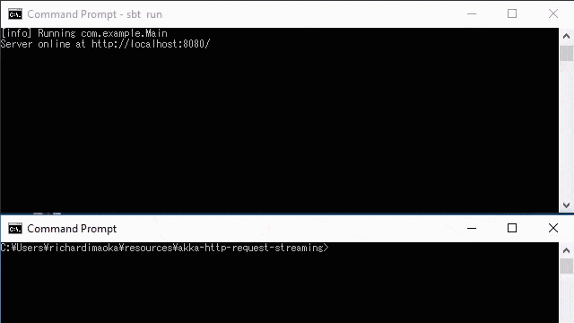

Blog article is at https://richardimaoka.github.io/blog/akka-http-request-streaming/

Do the following to run the example.

> git clone https://github.com/richardimaoka/resources.git
> cd resources
> cd akka-http-request-streaming
> sbt
> run

once the HTTP server is up, then run the following command.

```
curl
  -X POST \
  -H "Content-type: application/json" \
  -H "Transfer-Encoding: chunked" \
  -d "@request.json" http://localhost:8080
```

you see the result like below:

